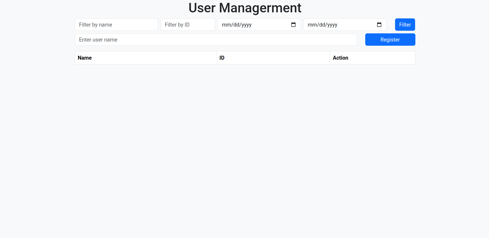

# Smart Lock Key 🔐

## 📌 Description

The Smart Lock Key is an IoT-based smart door locking system that enables users to remotely control and monitor access via the Internet. The system integrates various hardware components including an Arduino board, ESP8266 WiFi module, fingerprint sensor, RFID reader, matrix keypad, and a relay circuit to control an electric lock. Users can manage the system through a web interface for centralized control and monitoring.

## 🚀 Usage

Users can interact entirely through the web interface — including registering new users and using filters to search or manage existing user data quickly and intuitively.

## 📸 Screenshots

## ✨ Features

- User registration through the web interface
- User filtering and quick lookup functionality
- Remote control and access monitoring
- Integration with fingerprint, RFID, keypad, and web dashboard

## 🌐 Demo

[👉 Try the demo here](https://tak1st.github.io/SmartLockKey/)

## 📄 Documentation

[📚 Full project documentation on Overleaf](https://www.overleaf.com/read/jvdyfqztfjzs#bf6e9d)
